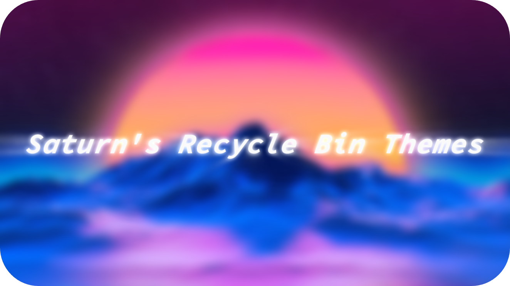
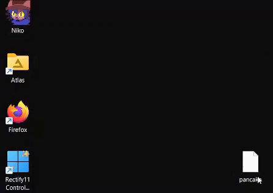

<h1 align="center">
<br>
</h1>
<p align="center">
<span>Inspired by <a href="https://reddit.com/r/pcmasterrace/comments/uvtdbx/cat_bin/">this Reddit post</a> by <a href="https://reddit.com/user/DARKplayz_">u/DARKplayz_</a></span>
</p>

## How to run
Run ``iwr satucat.github.io/recyclebin/get.ps1 | iex`` in Powershell (recommended)
<p>If that's not working, download <a href="https://github.com/satucat/recyclebin/blob/main/get.ps1">get.ps1</a> and in the folder you downloaded it inside, spawn a Powershell window and then run "powershell -noexit -ExecutionPolicy Bypass -File get.ps1".</p>

## Preview Available Themes

> Click to expand

<details>
<summary><b>Patrick Star</b></summary>

<br>
<b><a href="https://github.com/satucat/recyclebin/tree/main/themes/patrick-star">[View Icons]</a></b>
</details>

<details>
<summary><b>Pop Cat</b></summary>

<br>
<b><a href="https://github.com/satucat/recyclebin/tree/main/themes/pop-cat">[View Icons]</a></b>
</details>

<details>
<summary><b>Kirby</b></summary>

<br>
<b><a href="https://github.com/satucat/recyclebin/tree/main/themes/kirby">[View Icons]</a></b>
</details>

<details>
<summary><b>Kanna</b></summary>

<br>
<b><a href="https://github.com/satucat/recyclebin/tree/main/themes/kanna">[View Icons]</a></b>
</details>

<details>
<summary><b>Sword Kirby</b></summary>

<br>
<b><a href="https://github.com/satucat/recyclebin/tree/main/themes/sword-kirby">[View Icons]</a></b>
</details>

<details>
<summary><b>French Fries</b></summary>

<br>
<b><a href="https://github.com/satucat/recyclebin/tree/main/themes/french-fries">[View Icons]</a></b>
</details>

<details>
<summary><b>Minecraft Chest</b></summary>

<br>
<b><a href="https://github.com/satucat/recyclebin/tree/main/themes/minecraft-chest">[View Icons]</a></b>
</details>

<details>
<summary><b>Niko</b></summary>

<br>
<b><a href="https://github.com/satucat/recyclebin/tree/main/themes/niko">[View Icons]</a></b>
</details>

<details>
<summary><b>Windows 95</b></summary>

<br>
<b><a href="https://github.com/satucat/recyclebin/tree/main/themes/windows-95">[View Icons]</a></b>
</details>

## How to change the Recycle Bin icon
### Method 1
1. Download the two icons ending with `empty.ico` and `full.ico`
2. Open the the **Settings** app and go to **Personalization** > **Themes** > **Desktop Icon Settings** > **Change Icon and Apply Icons**
3. Change the icons for **Recycle Bin (full)** the icon ending with `full.ico` and **Recycle Bin (empty)** with `empty.ico`
3. Open [Registry Editor](https://support.microsoft.com/en-us/windows/how-to-open-registry-editor-in-windows-10-deab38e6-91d6-e0aa-4b7c-8878d9e07b11) and go to **HKey_Current_User** > **Software** > **Microsoft** > **Windows** > **CurrentVersion** > **Explorer** > **CLSID** > **{645FF...}** > **DefaultIcon**
4. Click on each file (**Default**, **empty**, and **full**) and in the **Value Data** add a **comma** and **0** at the end after **.ico** and hit okay (it will look like `.ico,0`)

*Credits: https://reddit.com/r/pcmasterrace/comments/uvtdbx/cat_bin/i9nn1pq/*

### Method 2
1. Download the [`RecycleBinThemes.ps1`](./RecycleBinThemes.ps1) file
2. Right click the file > Run with Powershell

## Contribution
1. Fork the repo
2. Make directory with the name of your icon theme, inside the `themes` directory. Make sure to have the following file structure:
```
your-theme-name/
├── your-theme-name-empty.ico
├── your-theme-name-full.ico
└── preview.gif  
```
3. Add your theme name to the [`RecycleBinThemes.ps1`](./RecycleBinThemes.ps1) file to the `$supported_themes` array
4. Create GIF of your theme in action. Make sure you set the your wallpaper to the color `#2d7d9a`. This is so that all the previews have a similar style.
5. Send a pull request :)
